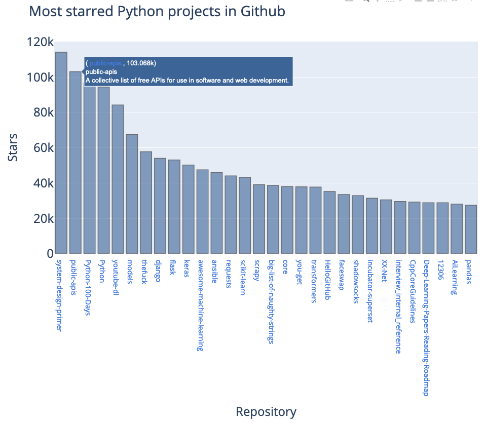

##### Setup

1) Install the <a href = "https://requests.readthedocs.io/en/master/"> Requests package </a> `python3 -m pip install --upgrade pip' command`. This package helps send HTTP requests.

2) Install the <a href = "https://plotly.com/python/"> Plotly </a> package `python3 -m pip install --user plotly`. This package is an open-source graphing library.

###### Capture some API data in `python_repos.py`         

It is useful to see how the data is returned from the API call.

- `custom headers` are passed in a dictionary to the headers parameter
- `res` is a response object return from `request`
- `res.json()` is a JSON decoder that converts the JSON data into a dictonary

    ~~~ py
    import requests  

    # Create API calll and store response
    url = 'https://api.github.com/search/repositories?q=language:python&sort=stars'
    headers = {'Accept': 'application/vnd.github.v3+json'}
    res = requests.get(url, headers=headers)
    print(f" Status code: {res.status_code}\n")
    print(f' res  {res}')

    # convert the API response data from JSON into a dictionary
    response_dict= res.json()

    # veiw the response data
    print(response_dict.keys())
    print(f' response_dict {response_dict} ')
    print(f" Total Python repositories >> {response_dict['total_count']}")

    repo_dicts = response_dict['items']
    print(f' Repositories returned : {len(repo_dicts)}')

    # Examine first repository
    repo_dict = repo_dicts[0]
    print(f"\n keys: {len(repo_dict)}")
    for key in sorted(repo_dict.keys()):
        print(f' key >> {key}')

    print("\n Selected info on each repository")    
    for repo_dict in repo_dicts:
        print(f' \n Name: {repo_dict["name"]}')
        print(f' Owner: {repo_dict["owner"]["login"]}')
        print(f' Stars: {repo_dict["stargazers_count"]}')
        print(f' Respository: {repo_dict["html_url"]}')
        print(f' Description: {repo_dict["description"]}')
    ~~~

##### Visualizing API data in `python_repos_visual.py`

1) Assign meta data and a link from each item within the `items` dictionary

    ~~~ py
    from plotly.graph_objs import Bar
    from plotly import offline

    # Create API calll and store response
    url = 'https://api.github.com/search/repositories?q=language:python&sort=stars'
    headers = {'Accept': 'application/vnd.github.v3+json'}
    r = requests.get(url, headers=headers)
    print(f" Status code: {r.status_code}\n")

    # store API response and process results
    response_dict= r.json()
    repo_dicts = response_dict['items']

    repo_links, stars, labels = [],[], []
    for repo_dict in repo_dicts:
        repo_name = repo_dict['name']
        repo_url = repo_dict['html_url']
        repo_link = f"<a href = '{repo_url}'> {repo_name} </a>"
        repo_links.append(repo_link)    

        stars.append(repo_dict['stargazers_count'])

        owner = repo_dict['owner']['login']
        description = repo_dict['description']
        label = f"{owner} {description}"
        labels.append(label)
    ~~~

2) Define data and layout format

    - `tooltips` are displayed for each item by defining the `hovertext` key
    - a link to each repository is created for each repository name

    ~~~ py
    # Build visualization
    data_format = [{
        'type': 'bar',
        'x': repo_links,
        'y': stars,
        'hovertext': labels,
        'marker': {
            'color': 'rgb(60, 100, 150)',
            'line': {'width': 1.5, 'color': 'rgb(25, 25, 25)'}
        },
        'opacity': 0.6,
    }]

    label_format = {
        'title': 'Most starred Python projects in Github',
        'titlefont': {'size': 28},
        'xaxis': {
            'title': 'Repository',
            'titlefont': {'size': 24},
            'tickfont': {'size': 14},
            },
        'yaxis': {
            'title': 'Stars',
            'titlefont': {'size': 24},
            'tickfont': {'size': 24},        
            },

    }
    ~~~

3) Generate an HTML file and display in the browser

    - `plotly` will generate standalone HTML and automatically launches the plot into your browser
    - the HTML file is saved locally

    ~~~ py
    # Create HTML
    figure = {'data': data_format, 'layout': label_format}
    offline.plot(figure, filename = 'python_repos.html')
    ~~~

    

###### A similar approach using the <a href = "https://github.com/HackerNews/API/"> HackerNews API </a>    

~~~ py
from operator import itemgetter
import time
import requests

from plotly.graph_objs import Bar
from plotly import offline

# Make an API call and store response data
url = "https://hacker-news.firebaseio.com/v0/topstories.json"

res =requests.get(url)
print(f' Status Code: {res.status_code}')

# Process info about each submission
submission_ids = res.json()
submission_dicts = []

for submission_id in submission_ids[:30]:
    # Make a separate API call for each submission
    url = f"https://hacker-news.firebaseio.com/v0/item/{submission_id}.json"
    res = requests.get(url)
    print(f' id: {submission_id}\t status: {res.status_code}')
    response_dict = res.json()

    # Create dictionary for each article
    submission_dict = {
        'title': response_dict['title'],
        'hn_link': f"http://news.ycombinator.com/item?id={submission_id}",
        'time': response_dict['time'],
        # 'comments': response_dict['descendants'],
        'score': response_dict['score'],
    }
    submission_dicts.append(submission_dict)

# submission_dicts = sorted(submission_dicts, key=itemgetter('comments'), reverse=True)
submission_dicts = sorted(submission_dicts, key=itemgetter('score', 'time'), reverse=True)

article_links, score_val, labels = [], [], []

for submission_dict in submission_dicts:
    # print(f'\n Title: {submission_dict["title"]}')
    # print(f' Discussion link: {submission_dict["hn_link"]}')
    # # print(f' Comments: {submission_dict["comments"]}')
    # print(f' Score: {submission_dict["score"]}')
    # print(f' Date: {time.ctime(submission_dict["time"])}')

    article_link = f'<a> {submission_dict["hn_link"]} </a>'
    article_links.append(article_link)

    score_val.append(submission_dict['score'])

    labels.append(submission_dict['title'])

data_format = [{
    'type': 'bar',
    'x': article_links,
    'y': score_val,
    'hovertext': labels,
    'marker': {
        'color': 'rgb(110, 10, 200)',
        'line': {'width': 1.5, 'color': 'rgb(15, 125, 45)'}
    },
    'opacity': 0.6,
}] 

label_format = {
    'title': 'Highest scored articles on HackerNews',
    'titlefont': {'size': 28},
    'xaxis': {
        'title': 'HackerNews Articles',
        'titlefont': {'size': 24},
        'tickfont': {'size': 14},
        },
    'yaxis': {
        'title': 'Score',
        'titlefont': {'size': 24},
        'tickfont': {'size': 24},        
        },
}

figure = {'data': data_format, 'layout': label_format}
offline.plot(figure, filename = 'hacker_news.html')
~~~